# Week3_web: 너 T야? 🤷‍♀️

## 소개

'MBTI별로 정말 갈리는 질문'들을 SNS에서 자주 접하셨을 겁니다. 그래서 준비했습니다. MBTI 통계청! MBTI별로 갈릴 만한 질문들을 누구나 업로드하고, 어떻게 대단이 갈리는지를 한눈에 볼 수 있습니다. 거기에 서로 의견 교환이 가능하도록 MBTI별 게시판과, 자신의 MBTI를 확인해보고 싶으신 분들을 위한 약식 테스트까지!

MBTI 초짜부터 과몰입러까지, "너 T야?"는 여러분 모두를 환영합니다.

## 1. Login

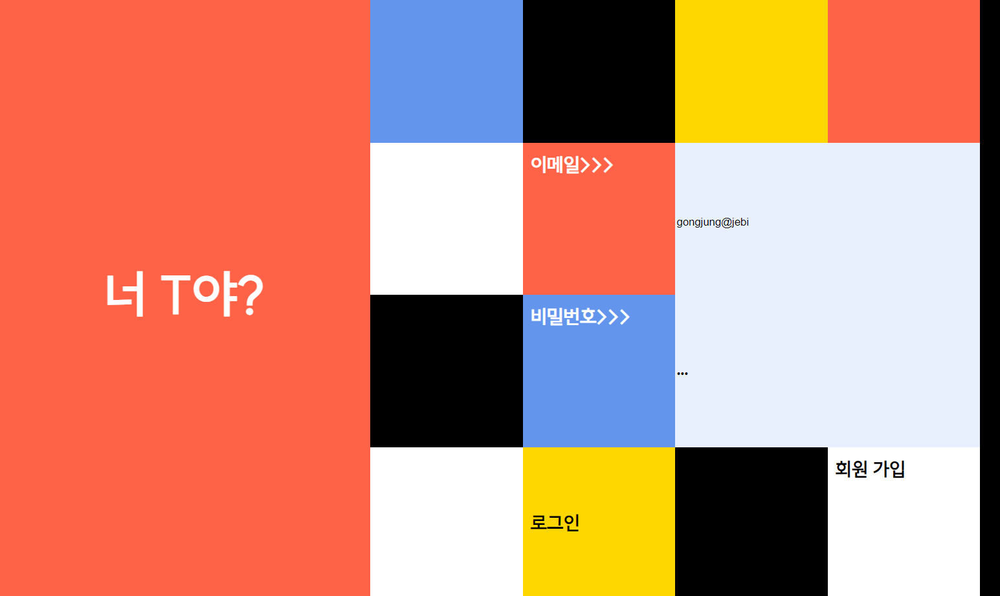

- 로그인 페이지입니다. 사각형의 버튼을 클릭해서 로그인하거나 회원가입을 할 수 있습니다.

## 2. Signin

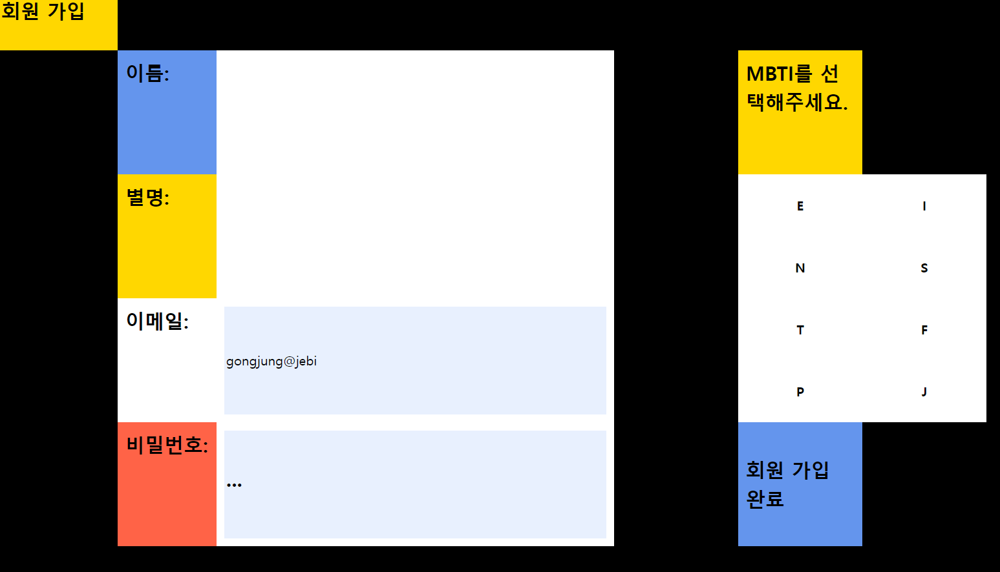 

- 회원가입 페이지입니다. 가입시 자신의 MBTI를 버튼을 눌러 입력할 수 있습니다.

## 3. Questions

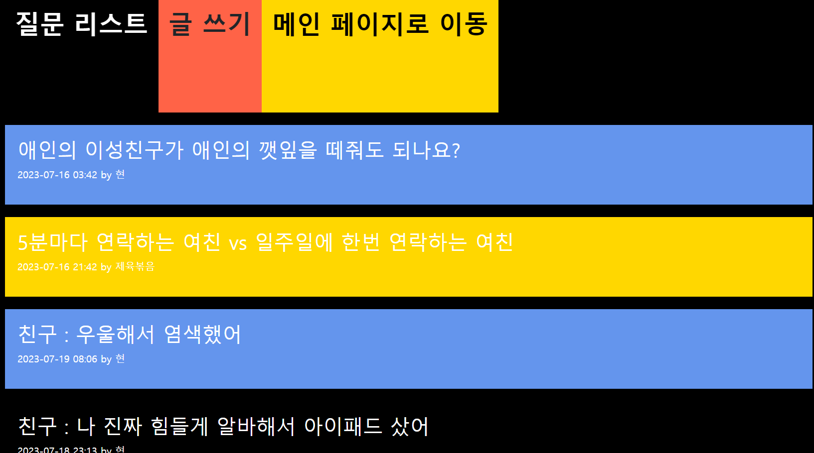 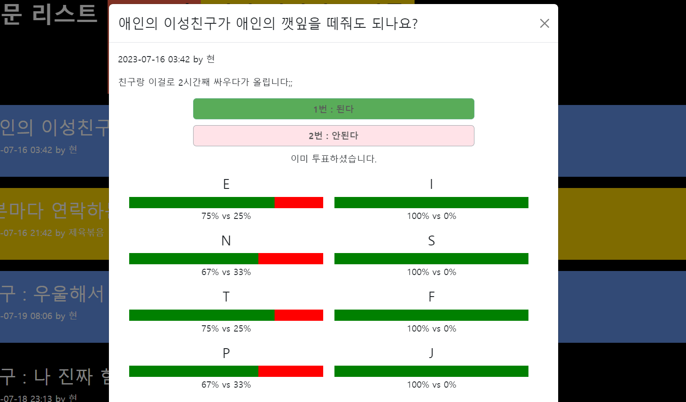
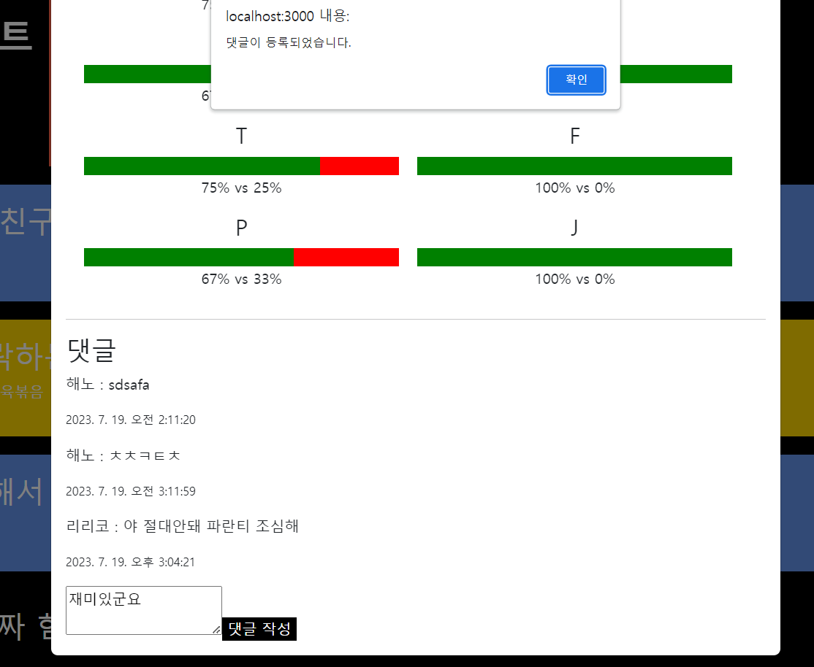 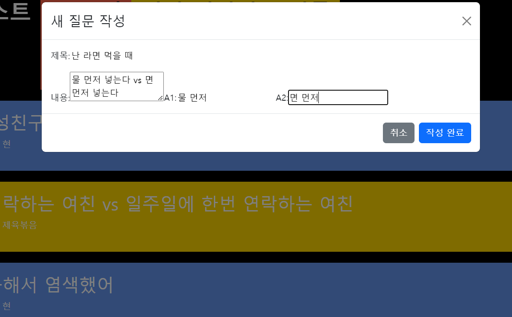

- 누구나 질문을 업로드하고 투표할 수 있습니다.
- 투표 결과는 MBTI의 총 여덟 알파벳 별로 두 선택지의 비율이 보여집니다.
- 각 질문 게시글에 대해서 댓글을 작성하며 소통할 수 있습니다.

## 4. Board

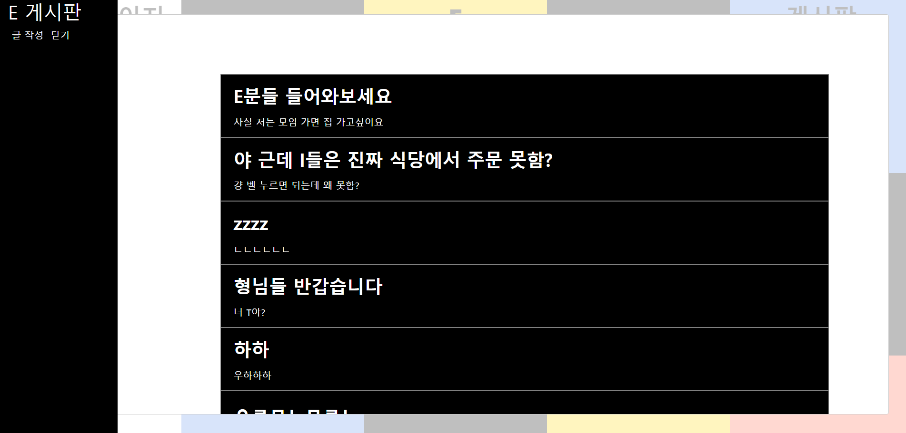 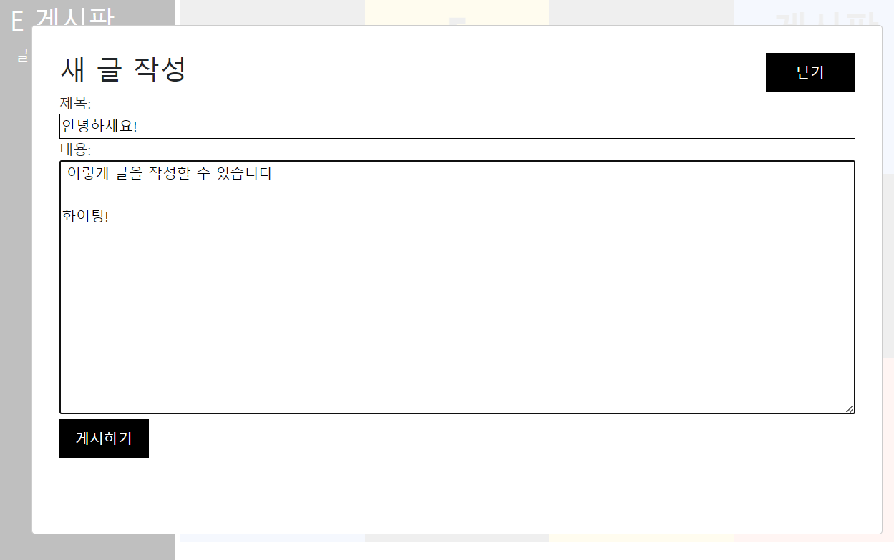

- 각 MBTI별로 MBTI에 대한 주제를 이야기하는 게시판이 있습니다.

## 5. Test

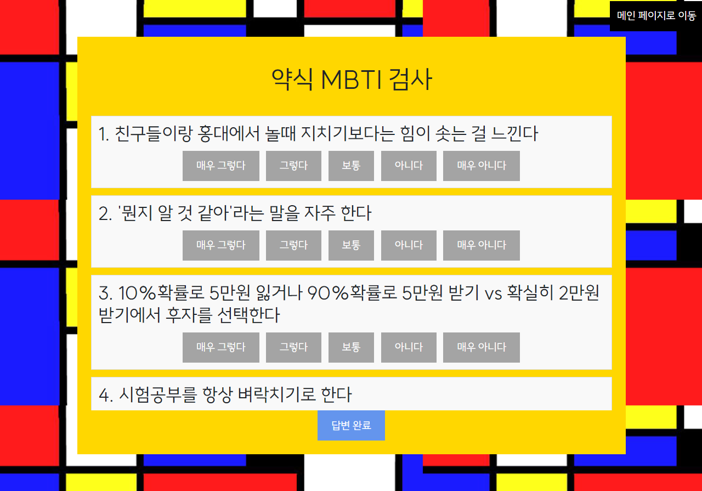 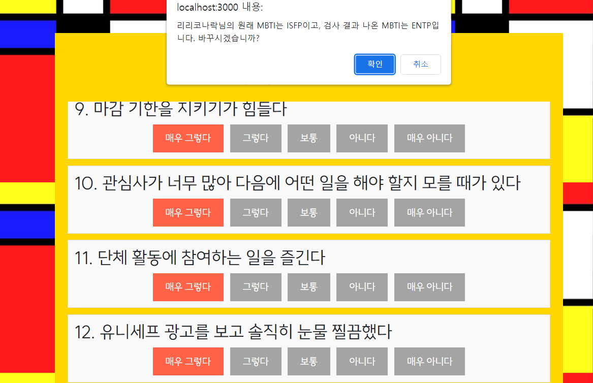

- 공식 MBTI 설문이 아닌, 저희의 약식 MBTI 테스트가 있습니다.
- 딱딱한 질문만이 아니라 재미있게 답할 수 있는 질문도 있답니다.
- 

## 6. Profile

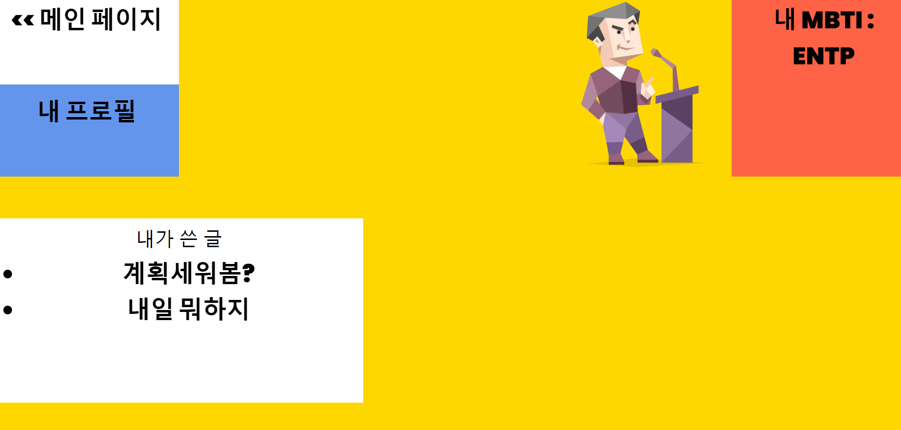 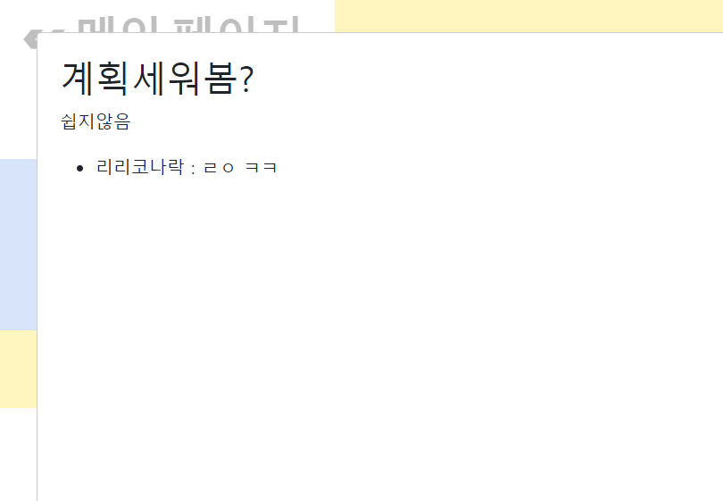
